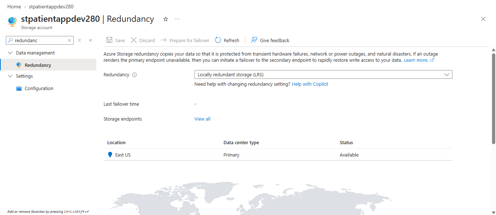
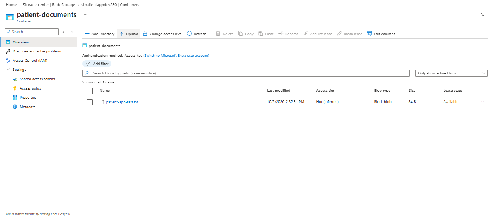
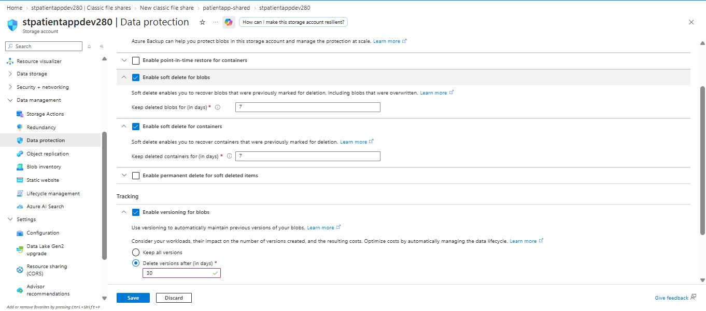
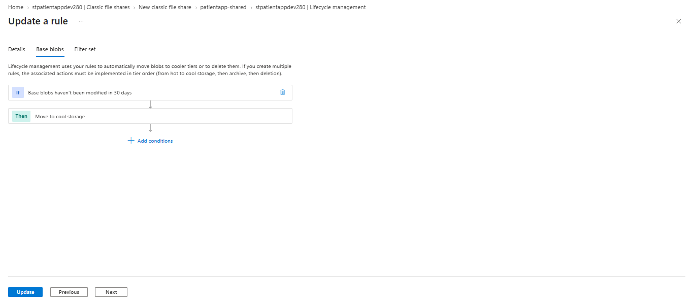
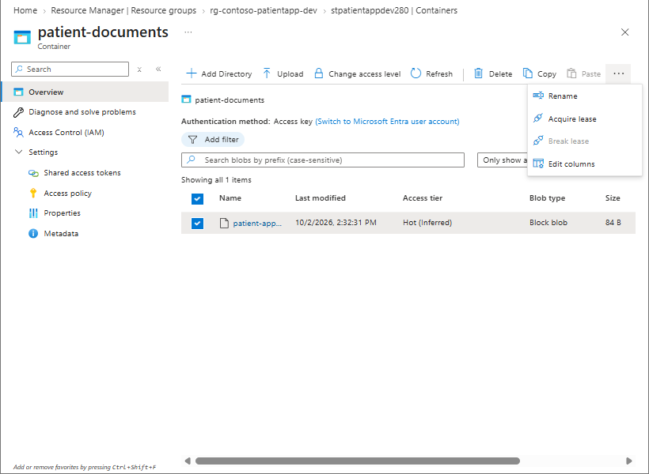
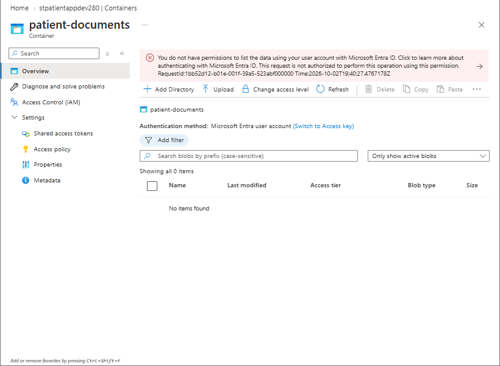
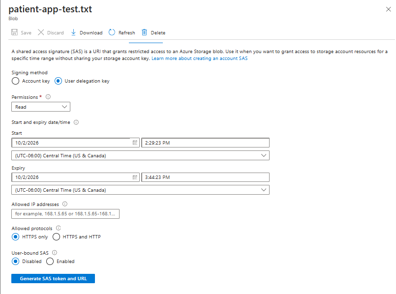
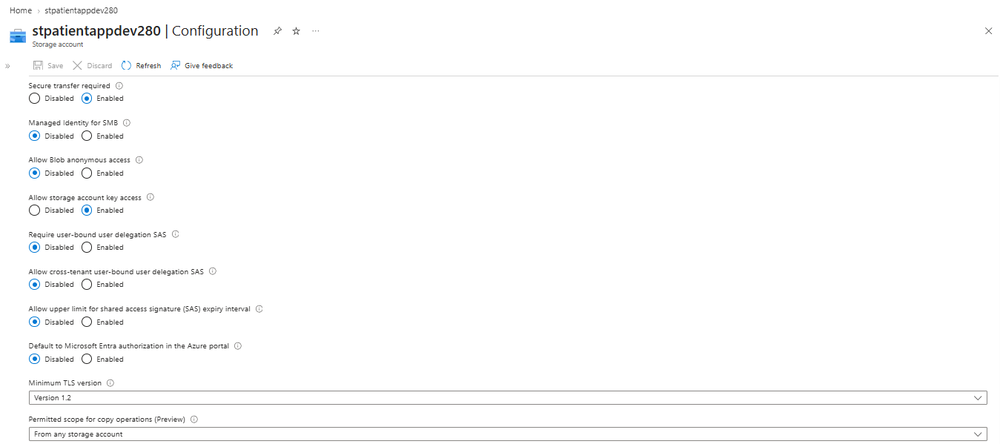
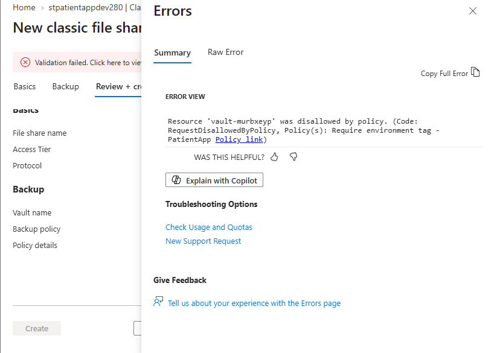

# Secure Azure Storage for a Healthcare Application Environment

## Overview

This project demonstrates the configuration and security of Azure Storage for a fictional healthcare organization, **Contoso Health Services**.

The environment supports both application object storage and shared file storage while implementing data protection, lifecycle management, least-privilege access, temporary delegated access, and storage security controls.

The lab also included troubleshooting Azure Policy and Microsoft Entra data-access issues.

## Business Scenario

Contoso Health Services is developing a patient-services application that requires:

- Blob Storage for application documents and exports
- Azure Files for shared file access
- Protection against accidental deletion and modification
- Lower-cost storage for older data
- Microsoft Entra ID and Azure RBAC for authorization
- Temporary delegated access through SAS
- Secure encrypted connections
- Governance through Azure Policy

## Architecture

```text
Azure Subscription
│
└── rg-contoso-patientapp-dev
    │
    └── stpatientappdev280
        │
        ├── Redundancy
        │   └── LRS
        │
        ├── Blob Storage
        │   └── patient-documents
        │       ├── Private access
        │       ├── patient-app-test.txt
        │       └── Storage Blob Data Reader
        │
        ├── Azure Files
        │   └── patientapp-shared
        │       └── SMB
        │
        ├── Data Protection
        │   ├── Blob soft delete
        │   ├── Container soft delete
        │   └── Blob versioning
        │
        ├── Lifecycle Management
        │   └── Move inactive blobs to Cool after 30 days
        │
        ├── User Delegation SAS
        │   └── Read-only temporary access
        │
        └── Security
            ├── HTTPS required
            ├── TLS 1.2 minimum
            └── Anonymous Blob access disabled
```

## Objectives

- Configure cost-appropriate storage redundancy
- Create private Blob Storage
- Create an Azure Files SMB share
- Configure soft delete and blob versioning
- Implement lifecycle management
- Configure data-plane RBAC
- Compare management-plane and data-plane permissions
- Generate and test a user delegation SAS
- Harden storage-account security
- Troubleshoot Azure Policy and Microsoft Entra authorization issues

## Implementation

### 1. Storage Redundancy

The storage account was originally configured with **Read-access geo-redundant storage (RA-GRS)**.

Because this environment is used for development and does not require cross-region disaster recovery, the redundancy configuration was changed to:

**Locally-redundant storage (LRS)**

This reduces unnecessary cost while maintaining multiple copies of the data within the primary region.



### 2. Private Blob Storage

Created a private Blob Storage container named:

`patient-documents`

Anonymous access was disabled so stored application documents cannot be accessed publicly without authorization.

A test blob named:

`patient-app-test.txt`

was uploaded to validate storage access.



### 3. Azure File Share

Created an Azure file share named:

`patientapp-shared`

The share was configured using **SMB** with the **Transaction optimized** access tier.

Azure Files was selected because this workload requires a shared filesystem rather than object storage.

## 4. Data Protection

Configured multiple data-protection features:

- Blob soft delete: 7 days
- Container soft delete: 7 days
- Blob versioning: Enabled
- Previous versions deleted after 30 days

These controls protect against different types of accidental data loss.

**Blob soft delete** helps recover deleted blobs.

**Container soft delete** helps recover deleted containers.

**Versioning** preserves earlier blob states after files are modified or overwritten.



## 5. Lifecycle Management

Created a lifecycle-management rule for the `patient-documents` container.

The rule moves base blobs that have not been modified for more than 30 days to the **Cool** access tier.

This reduces storage cost without automatically deleting application data.



## 6. Data-Plane RBAC

The compliance team already had the Azure **Reader** role at the resource-group scope.

Reader provides management-plane visibility into Azure resource configuration but does not grant permission to read the actual contents stored inside Blob Storage.

To provide least-privilege blob access, the following role was assigned:

**Storage Blob Data Reader**

Principal:

`grp-patientapp-compliance`

Scope:

`patient-documents`

This allows the compliance group to read Blob data without granting write access or broader storage-account permissions.



## Management Plane vs. Data Plane

This lab demonstrated an important Azure authorization distinction.

### Management Plane

Management-plane roles control the Azure resource itself.

Examples include:

- Reader
- Contributor
- Owner

These roles allow users to inspect or configure resources such as the storage account.

### Data Plane

Data-plane roles control access to the data stored inside the resource.

Examples include:

- Storage Blob Data Reader
- Storage Blob Data Contributor
- Storage Blob Data Owner

During testing, my account could manage the storage account but could not list Blob data using Microsoft Entra authentication.



The issue was resolved by assigning an appropriate Blob data role.

This demonstrated that:

**Management-plane access does not automatically provide data-plane access.**

## 7. User Delegation SAS

A **user delegation SAS** was generated for the test blob using Microsoft Entra authorization.

The SAS configuration used:

- User delegation key
- Read permission only
- HTTPS only
- Short expiration period



The generated SAS URL was tested from an InPrivate browser session.

The test file was accessible without signing into Azure because the SAS provided temporary delegated authorization.

The SAS token itself was not stored in this repository.

## 8. Storage Security

The storage account was hardened with:

- Secure transfer required
- Minimum TLS version 1.2
- Anonymous Blob access disabled

These settings help ensure encrypted communication and prevent unauthorized anonymous access.



## Troubleshooting

### Azure Policy Blocked Backup Vault Creation

While creating the Azure file share, the Azure portal attempted to create a supporting backup vault.

The deployment failed because an Azure Policy assigned in the previous governance project required resources to contain an:

`Environment`

tag.

The automatically generated vault did not satisfy the policy requirement.



Backup was disabled for this lab because Azure Backup will be configured separately in a later monitoring and disaster-recovery project.

This demonstrated that supporting resources can cause a deployment to fail even when the primary resource configuration is valid.

### Microsoft Entra Data Access Failure

Another issue occurred when switching the Blob container from storage account key authentication to Microsoft Entra authentication.

The signed-in identity could manage the storage account but could not list the blobs.

The cause was the absence of an appropriate **Blob data-plane role**.

Assigning **Storage Blob Data Contributor** resolved the issue.

## Validation Results

| Test | Expected Result | Result |
|---|---|---|
| Redundancy changed to LRS | Lower-cost development storage | Passed |
| Private Blob container created | Anonymous access prevented | Passed |
| Azure Files share created | SMB shared storage available | Passed |
| Blob soft delete | Deleted blobs protected | Passed |
| Container soft delete | Deleted containers protected | Passed |
| Blob versioning | Earlier blob states preserved | Passed |
| Lifecycle rule | Older blobs move to Cool | Passed |
| Compliance RBAC | Read-only Blob access | Passed |
| Microsoft Entra data access | Appropriate data-plane role required | Passed |
| User delegation SAS | Temporary read-only access | Passed |
| InPrivate SAS test | Blob accessible through SAS | Passed |
| Secure transfer | HTTPS required | Passed |
| Minimum TLS | TLS 1.2 configured | Passed |
| Anonymous Blob access | Disabled | Passed |

## Security Decisions

### Least Privilege

The compliance group received **Storage Blob Data Reader** instead of a write-capable role.

The assignment was scoped to the `patient-documents` container rather than the entire storage account.

### Private Blob Access

Anonymous Blob access was disabled so application data cannot be exposed publicly.

### Identity-Based Authorization

Microsoft Entra ID and Azure RBAC were used for identity-based storage access.

This separates permissions to manage the Azure resource from permissions to access the underlying data.

### Temporary Delegated Access

The SAS was limited to:

- Read access
- HTTPS
- Short expiration

This reduces the exposure associated with temporary shared access.

### Data Protection

Soft delete and versioning were enabled to protect against accidental deletion and overwriting.

### Cost Optimization

LRS was selected instead of RA-GRS for the development workload.

Lifecycle management moves older data to the Cool tier.

## Key Azure Concepts Demonstrated

- Azure Storage accounts
- Blob Storage
- Azure Files
- SMB
- LRS and RA-GRS
- Private Blob containers
- Blob soft delete
- Container soft delete
- Blob versioning
- Lifecycle management
- Hot and Cool access tiers
- Azure RBAC
- Storage Blob Data Reader
- Storage Blob Data Contributor
- Management plane vs. data plane
- Microsoft Entra authentication
- User delegation SAS
- Azure Policy
- Secure transfer
- TLS 1.2
- Storage security
- Troubleshooting

## Lessons Learned

This project reinforced that Azure Storage security consists of multiple independent layers.

Azure management roles such as Reader and Contributor do not automatically provide Azure RBAC permission to access Blob data.

Azure Policy can also block supporting resources created by another Azure service, which means troubleshooting must consider dependent resources in addition to the primary deployment.

A secure storage design can combine:

- Identity-based authorization
- Private containers
- Temporary SAS access
- Data-protection controls
- Lifecycle management
- Encryption requirements
- Azure Policy governance

## Cleanup and Cost Notes

This lab uses LRS to reduce cost for the development environment.

Lifecycle management moves older blobs to the Cool tier to further reduce storage expense.

The storage account will be reused in later AZ-104 networking and backup/disaster-recovery labs.

SAS URLs should be allowed to expire and should never be committed to source control.
